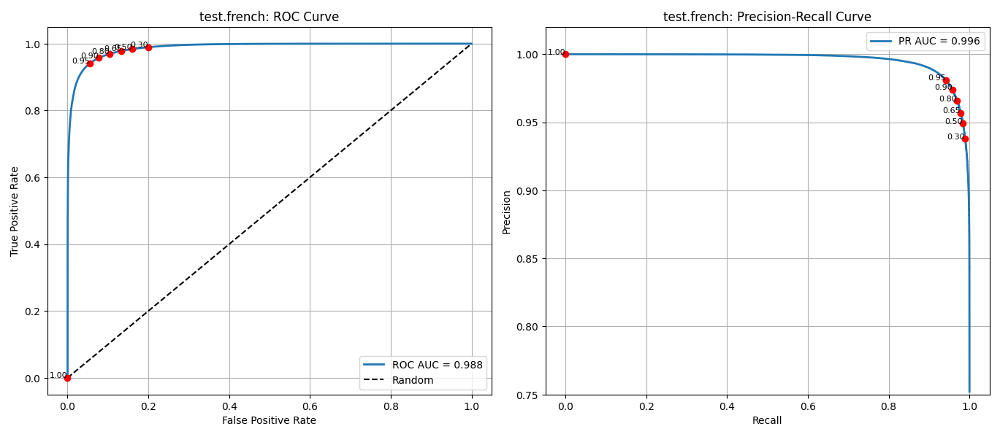
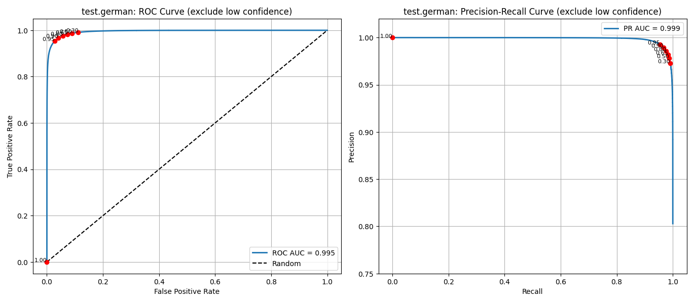

AUC metrics example

Dataset Card on HuggingFace.
https://huggingface.co/datasets/guynich/multilingual_librispeech_test_vad

Model: Silero VAD
https://github.com/snakers4/silero-vad

# Introduction

This repo computes AUC metrics for the test dataset with Silero VAD model.

# Installation

This section describes installation for the working test example in this repo.

The first step is to clone this repo.
```console
cd
git clone git@github.com:guynich/vad_eval_curves_multilingual.git
```

The main script has dependencies.  For these steps I used Ubuntu 22.04 and
Python `venv` virtual environment.  The script plots require tkinter.
```console
sudo apt install -y python3.10-venv
sudo apt-get install python3-tk

cd
python3 -m venv venv_vad_eval_curves_multilingual
source ./venv_vad_eval_curves_multilingual/bin/activate

cd vad_eval_curves_multilingual

python3 -m pip install --upgrade pip
python3 -m pip install -r requirements.txt
```

# Run the test script

Coded with help from ChatGPT and Copilot.

```console
cd
source ./venv_vad_eval_curves_multilingual/bin/activate
cd vad_eval_curves_multilingual

python3 main.py
```

## Results

| Split name      | ROC AUC | PR AUC |
| --------------- | ------: | -----: |
| test.dutch      |   0.977 |  0.989 |
| test.french     |   0.988 |  0.996 |
| test.german     |   0.984 |  0.995 |
| test.italian    |   0.985 |  0.995 |
| test.polish     |   0.988 |  0.997|
| test.portuguese |   0.983 |  0.995 |
| test.spanish    |   0.981 |  0.993 |

Speech features marked as low confidence are excluded in the following
data and plots titled "(exclude low confidence)".  See
[Dataset Card](https://huggingface.co/datasets/guynich/librispeech_asr_test_vad)
for discussion.

| Split name      | ROC AUC | PR AUC |
| --------------- | ------: | -----: |
| test.dutch      |   0.993 |  0.996 |
| test.french     |   0.996 |  0.999 |
| test.german     |   0.995 |  0.999 |
| test.italian    |   0.996 |  0.999 |
| test.polish     |   0.998 |  1.000 |
| test.portuguese |   0.995 |  0.999 |
| test.spanish    |   0.995 |  0.999 |

### test.dutch


### test.french




### test.german




### test.italian


### test.polish


### test.portuguese


### test.spanish


### console metrics
```
{'test.dutch': AUCMetrics(roc_auc=np.float64(0.9766509685712303),
                          pr_auc=np.float64(0.9893573682725301),
                          count=1434158,
                          count_speech_true=np.int64(1018173),
                          active_speech_hours=np.float64(9.050426666666667)),
 'test.dutch_confidence': AUCMetrics(roc_auc=np.float64(0.993202108528278),
                                     pr_auc=np.float64(0.9978201283022134),
                                     count=1326215,
                                     count_speech_true=np.int64(1018173),
                                     active_speech_hours=np.float64(9.050426666666667)),
 'test.french': AUCMetrics(roc_auc=np.float64(0.9878548942374121),
                           pr_auc=np.float64(0.995840364550055),
                           count=1131430,
                           count_speech_true=np.int64(850956),
                           active_speech_hours=np.float64(7.564053333333334)),
 'test.french_confidence': AUCMetrics(roc_auc=np.float64(0.9958094161468629),
                                      pr_auc=np.float64(0.9989344976993809),
                                      count=1065242,
                                      count_speech_true=np.int64(850956),
                                      active_speech_hours=np.float64(7.564053333333334)),
 'test.german': AUCMetrics(roc_auc=np.float64(0.9840970093414404),
                           pr_auc=np.float64(0.9945442431579096),
                           count=1606445,
                           count_speech_true=np.int64(1212759),
                           active_speech_hours=np.float64(10.78008)),
 'test.german_confidence': AUCMetrics(roc_auc=np.float64(0.9948651916456586),
                                      pr_auc=np.float64(0.9987078812762121),
                                      count=1510519,
                                      count_speech_true=np.int64(1212759),
                                      active_speech_hours=np.float64(10.78008)),
 'test.italian': AUCMetrics(roc_auc=np.float64(0.9848628923832952),
                            pr_auc=np.float64(0.9951884800012321),
                            count=592613,
                            count_speech_true=np.int64(456356),
                            active_speech_hours=np.float64(4.0564977777777775)),
 'test.italian_confidence': AUCMetrics(roc_auc=np.float64(0.996019039338777),
                                       pr_auc=np.float64(0.9991608482709256),
                                       count=550655,
                                       count_speech_true=np.int64(456356),
                                       active_speech_hours=np.float64(4.0564977777777775)),
 'test.polish': AUCMetrics(roc_auc=np.float64(0.9876797189675741),
                           pr_auc=np.float64(0.9967085219917624),
                           count=240966,
                           count_speech_true=np.int64(192742),
                           active_speech_hours=np.float64(1.7132622222222222)),
 'test.polish_confidence': AUCMetrics(roc_auc=np.float64(0.9983348721125866),
                                      pr_auc=np.float64(0.9996892280154609),
                                      count=228314,
                                      count_speech_true=np.int64(192742),
                                      active_speech_hours=np.float64(1.7132622222222222)),
 'test.portuguese': AUCMetrics(roc_auc=np.float64(0.9834079447848605),
                               pr_auc=np.float64(0.994732499107326),
                               count=420171,
                               count_speech_true=np.int64(325569),
                               active_speech_hours=np.float64(2.8939466666666664)),
 'test.portuguese_confidence': AUCMetrics(roc_auc=np.float64(0.9950821261046421),
                                          pr_auc=np.float64(0.9989033765096149),
                                          count=394068,
                                          count_speech_true=np.int64(325569),
                                          active_speech_hours=np.float64(2.8939466666666664)),
 'test.spanish': AUCMetrics(roc_auc=np.float64(0.9806427583650428),
                            pr_auc=np.float64(0.9925636537302218),
                            count=1124364,
                            count_speech_true=np.int64(846839),
                            active_speech_hours=np.float64(7.527457777777777)),
 'test.spanish_confidence': AUCMetrics(roc_auc=np.float64(0.9945154598613849),
                                       pr_auc=np.float64(0.998513513101432),
                                       count=1048605,
                                       count_speech_true=np.int64(846839),
                                       active_speech_hours=np.float64(7.527457777777777))}
```
